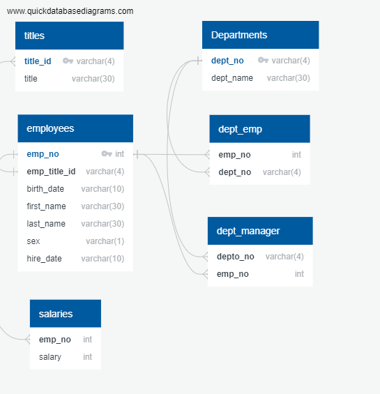

# sql-challenge

# **Overview**

This program uses postgreSQL to create a database for the remaining csv files of an old employee database and perform some Data Analytics on the data obtained

# **Database ERD**

# **Task List**

- [X] List the following details of each employee: employee number, last name, first name, sex, and salary.
- [X] List first name, last name, and hire date for employees who were hired in 1986.
- [X] List the manager of each department with the following information: department number, department name, the manager's employee number, last name, first name.
- [X] List the department of each employee with the following information: employee number, last name, first name, and department name.
- [X] List first name, last name, and sex for employees whose first name is "Hercules" and last names begin with "B."
- [X] List all employees in the Sales department, including their employee number, last name, first name, and department name.
- [X] List all employees in the Sales and Development departments, including their employee number, last name, first name, and department name.
- [X] In descending order, list the frequency count of employee last names, i.e., how many employees share each last name.