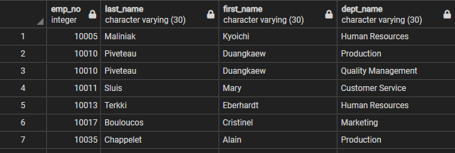

# **Overview**

This program uses postgreSQL to create a database for the remaining csv files of an old employee database and perform some Data Analytics on the data obtained

# **Repository Structure**

```bash
│   .gitignore                  # git ignore file
│   changelog.md                # app changelog
│   config.py                   # postgreSQL password file
│   LICENSE                     # repository license
│   README.md                   # readme file
│   suspicions.ipynb            # data analysis jupyter notebook
│
├───EmployeeSQL                 # folder with csv files to create database from
│       departments.csv
│       dept_emp.csv
│       dept_manager.csv
│       employees.csv
│       salaries.csv
│       titles.csv
│
├───queries                     # folder with postgreSQL queries
│       queries.sql
│       table_creation.sql
│
├───resources                   # images and resources for the repository
│       erd.pdf
│       erd.png
│       erd.txt
│       header_opt.png
```

# **Database ERD**


# **Task List**

- [X] List the following details of each employee: employee number, last name, first name, sex, and salary.
- [X] List first name, last name, and hire date for employees who were hired in 1986.
- [X] List the manager of each department with the following information: department number, department name, the manager's employee number, last name, first name.
- [X] List the department of each employee with the following information: employee number, last name, first name, and department name.

- [X] List first name, last name, and sex for employees whose first name is "Hercules" and last names begin with "B."
- [X] List all employees in the Sales department, including their employee number, last name, first name, and department name.
- [X] List all employees in the Sales and Development departments, including their employee number, last name, first name, and department name.
- [X] In descending order, list the frequency count of employee last names, i.e., how many employees share each last name.


# **Insights**

- After all the queries and getting to know the database better, there seems to be something wrong
- The database will be analyzed in a jupyter notebook [suspicions](suspicions.ipynb)
- The data analysis and insight are embedded as markdown in the jupyter notebook